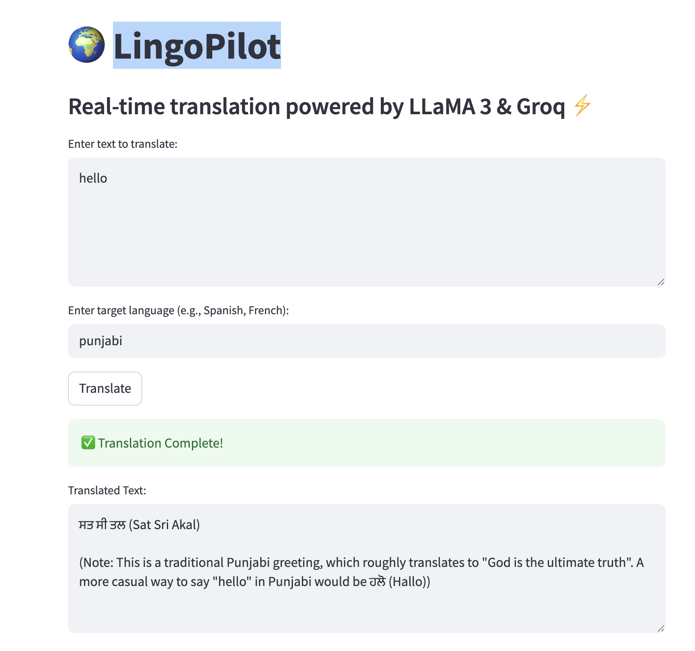

# 🌍 LingoPilot – Your Personal Language Translation Copilot ✈️

LingoPilot is an AI-powered multilingual translator and conversation assistant designed to help users communicate effortlessly across languages. Built using LangChain, Groq’s LLaMA3, and Streamlit, this app provides real-time, context-aware translations in a clean and interactive UI.

## 🚀 Features

- 🌐 **Multilingual Translation** – Translate phrases and sentences into multiple languages with a single click.
- 🧠 **Powered by LLaMA3-70B** – Uses Groq’s blazing-fast LLM to ensure accurate, natural-sounding translations.
- 💬 **Conversational Interface** – Simulate conversations with AI in multiple languages.
- 🎨 **Custom UI Styling** – Clean, responsive design built with Streamlit and styled using HTML/CSS.
- 🔐 **Secure API Integration** – Secrets and API keys handled using environment variables via `python-dotenv`.

## 📸 Demo

 <!-- Replace with an actual screenshot if available -->

## 🛠️ Tech Stack

- **Frontend:** Streamlit + Custom HTML/CSS
- **Backend:** Python, LangChain, Groq API (LLaMA3)
- **Others:** dotenv, LangSmith (for tracing & debugging)

## 🧰 Setup Instructions

1. **Clone the Repository**
   ```bash
   git clone https://github.com/yourusername/lingopilot.git
   cd lingopilot
